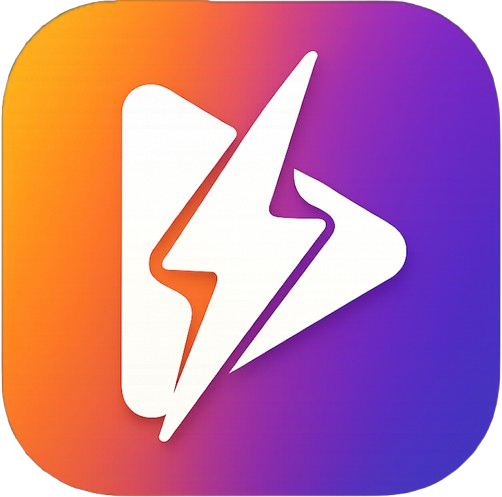

## Overview

ZapTok is a decentralized video platform powered by Bitcoin and Nostr. We deliver censorship-resistant content sharing with lightning-fast Bitcoin tips, giving creators and users complete control over their data and earnings. Experience familiar social media with true ownership and privacy - where your content and earnings are actually yours.

### 🎯 Phase 1: Foundation (Completed ✅)
**Core Platform & Authentication**
- [x] Private login via Nostr browser extension + bunker login (NIP-07, NIP-46)
- [x] Lightning & Cashu wallet support (NIP-47, NIP-60, NIP-61)
- [x] Enhanced video encoding and streaming (NIP-71)
- [x] Multi-relay support and relay management
- [x] Basic content moderation tools

**Creator Economy Basics**
- [x] Lightning Network integration for instant zap functionality (NIP-57)
- [x] Cashu wallet integration for eCash payments (NIP-60)
- [x] Nutzaps for peer-to-peer eCash tips (NIP-61)

**Infrastructure**
- [x] Decentralized storage integration (NIP-94 file metadata)
- [x] Bech32 address support (NIP-19)
- [x] DNS-based verification (NIP-05)

### 🌟 Phase 2: Social Features (In Progress 🚧)
**Essential Social**
- [x] Follow Lists (NIP-02)
- [x] Reactions & Engagement (NIP-25)
- [x] User Profiles & Metadata (NIP-01, kind 0)
- [ ] Replies, Mentions, Threads & Notifications (NIP-10)
- [ ] Private Messages (NIP-17)

**Content & Discovery**
- [x] Video Events (NIP-71)
- [x] File metadata support (NIP-94)
- [ ] Hashtag Following and Custom Hashtags
- [ ] Reposts & Quotes (NIP-18)
- [ ] Content Search (NIP-50)

### 🏗️ Phase 3: Advanced Platform (Planned 📋)
**Enhanced Creator Tools**
- [x] Zaps & Advanced Tipping (NIP-57)
- [ ] Zap Goals & Splits (NIP-75)
- [ ] Badges & Creator Recognition (NIP-58)
- [ ] Long-form Content Support (NIP-23)

**Community Features**
- [ ] Public Chats (NIP-28)
- [ ] Moderated Communities (NIP-72)
- [ ] Polls & Interactive Content (NIP-69)
- [ ] Live Activities & Streaming (NIP-53)

**Platform Expansion**
- [ ] Cross-platform mobile apps (iOS/Android)
- [ ] Marketplace Integration (NIP-15)
- [ ] Multiple Account Support
- [ ] Push Notifications

## Philosophy

ZapTok believes in:
- **Self sovereignty**: Users own their data, identity, and monetary interactions - no intermediaries, no gatekeepers
- **Censorship resistance**: Decentralized architecture with no single point of failure or control
- **Privacy by design**: Built-in privacy protections, not afterthoughts or add-ons 
- **Open source**: Transparent, auditable code that the community can verify and improve

## How ZapTok's Protocol Integration Benefits You:

For Creators:
Own Your Brand & Earnings

- Keep your identity and follower relationships (Nostr) - no platform can delete you
- Receive instant Bitcoin tips with zero platform fees
- Get paid 24/7 from a global audience without banking restrictions
- Build once, publish everywhere - your content works across Nostr apps
- No chargebacks or payment reversals on tips received
  
For Viewers/Fans:
True Privacy & Control

- Watch and interact without giving up personal data
- Tip creators directly with pseudo-anonymous Bitcoin payments
- Your viewing history and preferences stay private by design
- Access content that can't be censored or geo-blocked
- Use the same identity across all Nostr-compatible apps
  
For Everyone:
Bulletproof & Transparent

- No single company can shut down the network or your account
- Open source code - verify security and suggest improvements
- Real-time interactions without corporate algorithms deciding what you see
- Global access - works the same no matter the location as long as you have internet access 
- Your posts and social connections are portable between platforms

## Community

- **Nostr**: Follow #ZapTok tag for updates
- **+Chorus community**: [chorus.community/zaptok](https://chorus.community/group/34550%3A8b12bddc423189c660156eab1ea04e1d44cc6621c550c313686705f704dda895%3Azaptok-mdgpgdbb)
- **GitHub**: Star the repository and watch for updates
- **Website**: TBA

### 🔮 Future Vision
**Complete Nostr Ecosystem**

Full NIP Implementation Status (Click to expand)

**✅ Fully Implemented**
- NIP-01: Basic protocol flow description
- NIP-02: Contact List and Petnames  
- NIP-05: DNS-based verification
- NIP-07: Browser extension interface
- NIP-19: Bech32-encoded entities
- NIP-25: Reactions
- NIP-46: Nostr Connect
- NIP-47: Wallet Connect (partial)
- NIP-57: Lightning Zaps
- NIP-60: Cashu Wallets
- NIP-61: Nutzaps
- NIP-71: Video Events
- NIP-94: File Metadata

**🚧 Partially Implemented**
- NIP-47: Wallet Connect (core features complete, advanced features pending)

**📋 Planned for Implementation**
- NIP-10: Conventions for `e` and `p` tags (replies/mentions)  
- NIP-17: Private Direct Messages
- NIP-18: Reposts
- NIP-23: Long-form Content
- NIP-28: Public Chat
- NIP-50: Search Capability
- NIP-53: Live Activities
- NIP-58: Badges
- NIP-72: Moderated Communities
- NIP-75: Zap Goals

**Research & Future Consideration**
- NIP-03: OpenTimestamps Attestations
- NIP-15: Nostr Marketplace
- NIP-42: Relay Authentication
- NIP-44: Versioned Encryption
- NIP-96: File Storage Integration

---

### 🤝 Community Driven
This roadmap evolves based on:
- Community feedback and feature requests
- Nostr protocol development (NIPs)
- Bitcoin Lightning Network improvements
- Creator and user needs

**Want to contribute?** Check our [Contributing Guidelines](CONTRIBUTING.md) or [open an issue](https://github.com/silentius-satoshi/ZapTok/issues) to suggest features!

---
⚡ Zap A Coffee for Contributors ⚡

**silentius satoshi** - [zapmeacoffee.com/silentius](https://zapmeacoffee.com/npub13vftmhzzxxyuvcq4d643agzwr4zvce3pc4gvxymgvuzlwpxa4z2sq4sjd9)

`npub13vftmhzzxxyuvcq4d643agzwr4zvce3pc4gvxymgvuzlwpxa4z2sq4sjd9`

---
*Last updated: [July 25, 2025]*

## License

ZapTok is licensed under the **GNU Affero General Public License v3.0 (AGPL-3.0)**.

### Why AGPL v3?

We chose AGPL v3 to ensure that:
- **All improvements remain open source**: Any modifications or deployments of ZapTok must share their source code
- **Network copyleft protection**: SaaS providers can't create proprietary versions
- **Creator & user protection**: Prevents big tech from exploiting the platform without contributing back
- **Community-driven development**: Ensures ZapTok remains controlled by its users and contributors, not corporations

### Copyright Notice

Copyright (c) 2025 silentius satoshi (silentius@nostrplebs.com)

This program is free software: you can redistribute it and/or modify it under the terms of the GNU Affero General Public License as published by the Free Software Foundation, either version 3 of the License, or (at your option) any later version.

### Brand Protection

"ZapTok" is a project created by silentius satoshi. While the code is open source under AGPL v3, please respect the brand identity when creating derivative works.

### Community Guidelines

- **Contributions welcome**: Submit PRs, report issues, suggest features
- **Fork freely**: Create your own versions while following AGPL v3 requirements  
- **Commercial use**: Allowed under AGPL v3 terms (source code must remain open)
- **Attribution**: Please credit original authors when redistributing

For the complete license text, see the [LICENSE](./LICENSE) file.

---

**Built with ❤️ by the Nostr community**

*Vibed with [MKStack](https://soapbox.pub/mkstack)*

