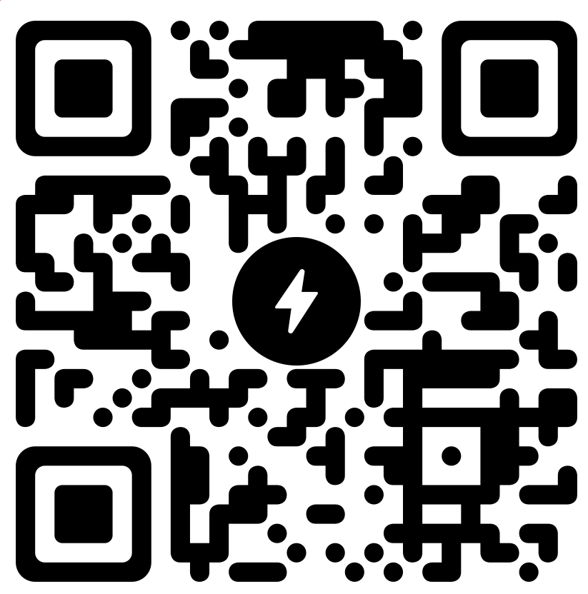

## Overview

ZapTok is a decentralized short-form video platform where instant Bitcoin meets endless swipeable content — enabling direct creator monetization through value-for-value on Nostr.

We deliver censorship-resistant content sharing with lightning-fast Bitcoin tips (aka zaps), giving creators and users complete control over their data and earnings. Experience familiar social media with true ownership and privacy — where your content and earnings are actually yours.

***You keep 100% of your earnings. No percentage of your earnings is distributed to the platform.***

### 🎬 **Video Platform**
- **Short-Form Video Sharing**: TikTok-style infinite scroll with snap-to-video behavior
- **Mobile-Optimized Player**: Gesture controls, keyboard navigation (arrow keys)
- **Advanced Performance**: Auto-loading, background prefetching, smooth playback caching
- **Video Compression**: Client-side optimization for mobile data efficiency
- **Native Sharing**: Web Share API with clipboard fallback across platforms

### ⚡ **Lightning & Payments**
- **Instant Bitcoin Zaps**: Lightning Network integration for immediate tips (NIP-57)
- **Cashu**: Wallet integration with peer-to-peer Nutzaps (NIP-60, NIP-61)
- **Supporter Donations**: Multiple payment pathways for creator support
- **Zero Platform Fees**: Creators keep 100% of earnings
- **Wallet Connect**: Lightning wallet integration (NIP-47)

### 🔐 **Decentralized Identity**
- **Private Login**: Nostr browser extension support (NIP-07)
- **Bunker Login**: Remote signer compatibility (NIP-46)
- **Self-Sovereign Identity**: Users own their data and social connections
- **DNS Verification**: Nostr address verification (NIP-05)
- **Portable Identity**: Same profile works across all Nostr apps

### 💬 **Social Features**
- **Follow System**: Contact lists and relationship management (NIP-02)
- **Content Sharing**: Reposts and quote sharing (NIP-18)
- **Rich Profiles**: User metadata and customizable profiles
- **Notification Center**: Real-time alerts for zaps, mentions, and reposts

### 💼 **Advanced Features**
- **Cashu Wallet Management**: Full wallet interface with transaction history
- **Relay Management**: Advanced relay configuration and monitoring
- **Video Analytics**: View tracking and engagement metrics
- **QR Code Scanner**: Built-in scanner for lightning invoices and Cashu tokens
- **Mint Discovery**: Automatic Cashu mint detection and management

### 📱 **Progressive Web App**
- **Full PWA Support**: Installable on mobile and desktop
- **Offline Capabilities**: Video caching and background playback
- **Push Notifications**: Real-time alerts for Lightning payments
- **Service Worker**: Background sync for failed transactions
- **Native App Feel**: Seamless mobile experience

### 🌐 **Nostr Integration**
- **Multi-Relay Support**: Connect to multiple relays for redundancy
- **Video Events**: Native video content format (NIP-71)
- **Bech32 Addresses**: Full NIP-19 identifier support
- **Content Discovery**: Hashtag following and search capabilities

### 🚀 **Coming Next**
- **Threaded Comments UI**: Display and interact with NIP-22 comments (backend ready)
- **Private Messages**: Encrypted DMs (NIP-17)
- **Live Streaming**: Real-time broadcasting (NIP-53)
- **Creator Tools**: Zap goals, badges, long-form content

## Philosophy

ZapTok believes in:
- **Self sovereignty**: Users own their data, identity, and monetary interactions - no intermediaries, no gatekeepers
- **Creator-first economy**: Tools and features that empower creators to monetize directly without middlemen taking a cut
- **Interoperability**: Seamless integration with other Nostr apps and services for a unified user experience
- **Open source**: Transparent, auditable code that the community can verify and improve
- **Privacy by design**: Built-in privacy protections, not afterthoughts or add-ons
- **Censorship resistance**: Decentralized architecture with no single point of failure or control 

## How ZapTok's Protocol Integration Benefits You:

For Creators:
Own Your Brand & Earnings

- Keep your identity and follower relationships (Nostr) - no platform can delete you
- Receive instant Bitcoin tips (aka lightning zaps in satoshis) with zero platform fees
- Get paid 24/7 from a global audience without banking restrictions
- Build once, publish everywhere - your content works across Nostr apps
- No chargebacks or payment reversals on zaps received
  
For Viewers/Fans:
True Privacy & Control

- Watch and interact without giving up personal data
- Tip creators directly with pseudo-anonymous Bitcoin zap payments
- Your viewing history and preferences stay private by design
- Access content that can't be censored or geo-blocked
- Use the same identity across all Nostr-compatible apps
  
For Everyone:
Bulletproof & Transparent

- No single company can shut down the network of relays or your nostr account
- Open source code - verify security and suggest improvements
- Real-time interactions without corporate algorithms deciding what you see
- Global access - works the same no matter the location as long as you have internet access 
- Your posts and social connections are portable between platforms

## Community

- **Give us a follow on Nostr**: [ZapTok@zaptok.social](https://njump.me/npub187ffdcqg4k56x2x3wmtlu6wkawuzm5k5wvzj980p0uvx3ek6tg7svrdkx8) & [silentius@zaptok.social](https://njump.me/npub13vftmhzzxxyuvcq4d643agzwr4zvce3pc4gvxymgvuzlwpxa4z2sq4sjd9)
- **+Chorus community**: [chorus.community/zaptok](https://chorus.community/group/34550%3A8b12bddc423189c660156eab1ea04e1d44cc6621c550c313686705f704dda895%3Azaptok-mdgpgdbb)
- **Website**: [https://zaptok.social](https://zaptok.social/)

## Future Vision

**Complete Nostr Ecosystem**

Full NIP Implementation Status (Click to expand)

**✅ Fully Implemented**
- NIP-01: Basic protocol flow description
- NIP-02: Contact List and Petnames  
- NIP-05: DNS-based verification
- NIP-07: Browser extension interface
- NIP-10: Conventions for `e` and `p` tags (replies/mentions)
- NIP-18: Reposts and Share functionality
- NIP-19: Bech32-encoded entities
- NIP-22: Comments (backend infrastructure and publishing)
- NIP-46: Nostr Connect
- NIP-47: Wallet Connect
- NIP-50: Search Capability
- NIP-57: Lightning Zaps
- NIP-60: Cashu Wallets
- NIP-61: Nutzaps
- NIP-71: Video Events

**Partially Implemented**
- NIP-22: Comments UI (threaded display coming soon)

**Planned for Implementation**
- NIP-17: Private Direct Messages
- NIP-53: Live Activities
- NIP-75: Zap Goals

**Research & Future Consideration**
- Bandwidth Optimization
- CDN/Mirror Integration
- Content Licensing & Rights Management
- Creator Analytics
- Creator Revenue Splits
- Cross-Platform Embedding
- Paywall Integrations
- Playlist Support
- Recurring Payments/Subscriptions
- Video Annotations & Timestamps
- Video Quality Metadata

## Community Driven

This roadmap evolves based on:
- Community feedback and feature requests
- Nostr protocol development (NIPs)
- Cashu protocol development (NUTs)
- Bitcoin / Lightning Network improvements
- Creator and user needs

## Want to Contribute?

For developers interested in contributing to ZapTok:

- **[Contributing Guidelines](./CONTRIBUTING.md)** - Development workflow, code standards, and contribution process
- **[Protocol Documentation](./public/docs/)** - Nostr NIPs and Cashu NUTs specifications
- **[Open an Issue](https://github.com/silentius-satoshi/ZapTok/issues)** - Report bugs, request features, or ask questions

## License

ZapTok is licensed under the **GNU Affero General Public License v3.0** (AGPL-3.0-or-later).

This means:
- ✅ You can use, study, modify, and share this software freely
- ✅ If you run a modified version as a web service, you must share your source code
- ✅ All modifications must also be licensed under AGPL-3.0
- ✅ This protects the open source community from proprietary forks

### Copyright Notice

Copyright (c) 2025 silentius-satoshi

This program is free software: you can redistribute it and/or modify it under the terms of the GNU Affero General Public License as published by the Free Software Foundation, either version 3 of the License, or (at your option) any later version.

For the complete license text, see the [LICENSE](./LICENSE) file.

For third-party dependency attributions, see the [NOTICE](./NOTICE) file.

## Support ZapTok

Help us continue building and improving ZapTok. Your support enables us to maintain the platform, add new features, and keep the community growing.

<table style="border: none; border-collapse: collapse;">
<tr>
<td align="center" style="border: none; padding: 0;">

 
<em>Follow us on</em> <strong><a href="https://njump.me/npub187ffdcqg4k56x2x3wmtlu6wkawuzm5k5wvzj980p0uvx3ek6tg7svrdkx8">nostr</a></strong>
</td>
<td width="40" style="border: none;"></td>
<td align="center" style="border: none; padding: 0;">

 
<em>Zap to show your support for ZapTok development:</em> <strong>zaptok@strike.me</strong>
</td>
</tr>
</table>

## Acknowledgments & Credits

ZapTok stands on the shoulders of giants. We're deeply grateful to the open-source communities and visionary builders who made this platform possible:

### Nostr Ecosystem Builders
- **[Amethyst](https://github.com/vitorpamplona/amethyst)** **([amethyst.social](https://www.amethyst.social/))** - Nostr client for Android
- **[Coracle](https://github.com/coracle-social/coracle)** **([coracle.social](https://coracle.social/))** - An experimental Nostr client focused on unlocking the full potential of multiple relays. Browse, filter, zap, and create custom feeds to create a curated Nostr experience
- **[Chorus](https://github.com/andotherstuff/chorus)** **([chorus.community](https://chorus.community/))** - Grow your community and gather support on the decentralized Nostr protocol with eCash
- **[Damus](https://github.com/damus-io)** **([damus.io](https://damus.io/))** - iOS nostr client
- **[Jumble](https://github.com/CodyTseng/jumble)** **([jumble.social](https://jumble.social/))** - A user-friendly Nostr client focused on relay feed browsing and relay discovery
- **[Nostr Band](https://github.com/nostrband)** **([nostr.band](https://nostr.band/))** - Nostr profile viewer and search engine
- **[Plebs](https://github.com/Spl0itable/plebs-app)** **([plebs.app](https://plebs.app/))** - Plebs is a censorship-resistant, decentralized video platform powered by the Nostr social protocol
- **[Primal](https://github.com/PrimalHQ)** **([primal.net](https://primal.net/))** - Primal's iOS/web app for Nostr; as experienced on primal.net
- **[Snort](https://github.com/v0l/snort)** **([phoenix.social](https://phoenix.social/))** - Feature packed nostr web UI, Mirror of https://git.v0l.io/Kieran/snort 
- **[Zappix](https://github.com/derekross/zappix)** **([Zappix.app](https://zappix.app/home))** - A nostr image sharing application for browsing, sharing, and zapping visual content
- **[Zap.stream](https://github.com/v0l/zap.stream)** **([Zap.stream](https://zap.stream/))** - Nostr live streaming

### Technical Foundation
- **React Team** - The UI framework powering our interface
- **Vite & Tailwind CSS** - Development tools enabling rapid iteration
- **[Nostr Protocol](https://github.com/nostr-protocol/nips)** - Collectively building the Nostr specification
- **[Bitcoin Connect](https://github.com/getAlby/bitcoin-connect)** **([Alby/Bitcoin-Connect](https://bitcoin-connect.com/))** - Connecting lightning wallets to your webapp has never been easier. Enable WebLN in all browsers with a single button
- **[Cashu Protocol](https://github.com/cashubtc)** **([cashu.space](https://cashu.space))** - Cashu is ecash for Bitcoin
- **[Blossom Protocol](https://github.com/hzrd149/blossom)** - Decentralized file storage solutions using nostr public / private keys 
- **[Nostr Logins](https://github.com/nostrband/nostr-login)** -  powerful window.nostr provider
- **[NoAuth](https://github.com/nostrband/noauth)** **([nsec.app](https://nsec.app/))** - Noauth Nostr key manager
- **[MKStack](https://soapbox.pub/mkstack)** **([Gitlab](https://gitlab.com/soapbox-pub/mkstack))** - Nostr client framework for web.

---

Built with ❤️ for our Nostr communities & the Open Source, Decentralized Web by [@silentius](https://nostr.band/npub13vftmhzzxxyuvcq4d643agzwr4zvce3pc4gvxymgvuzlwpxa4z2sq4sjd9)

